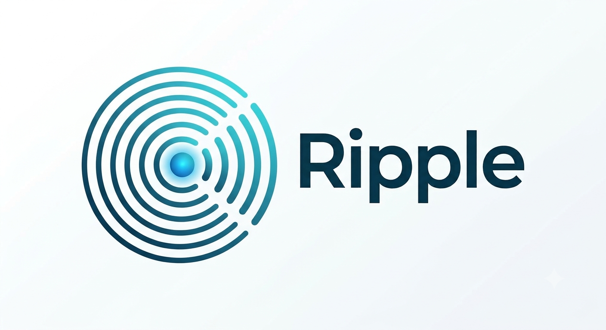

<p align="center">
  
</p>

<h1 align="center">Ripple for Laravel</h1>

<p align="center">
  <strong>Laravel broadcasting driver for <a href="https://github.com/madisoheib/ripple">Ripple</a> — a self-hosted, Pusher-compatible WebSocket server shipped as a single static binary.</strong>
</p>

<p align="center">
  <a href="LICENSE"></a>
</p>

No Redis, no Node, no PHP extensions. The server speaks the Pusher protocol, so
Laravel Echo and your existing broadcasting code work unchanged — this package
just wires Laravel to it and manages the binary for you.

## Requirements

- PHP ≥ 7.4
- Laravel 6, 7, 8, 9, 10, 11, 12 or 13 — one package version covers all.
  Every version is verified end-to-end (real app, real broadcast, real
  pusher-js subscriber) by [`qa/laravel/matrix.sh`](https://github.com/madisoheib/ripple/blob/main/qa/laravel/matrix.sh):

| Laravel | PHP tested | Status |
|---|---|---|
| 6 / 7 | 7.4 | ✅ |
| 8 | 8.0 | ✅ |
| 9 | 8.1 | ✅ |
| 10 | 8.2 | ✅ |
| 11 / 12 | 8.3 | ✅ |
| 13 | 8.4 | ✅ |

## Installation — two commands, any Laravel project

```bash
composer require ripple/ripple-laravel
php artisan ripple:install
```

`ripple:install` does everything:
- detects your OS/architecture (Linux x86_64/ARM64, macOS Intel/Apple Silicon,
  Windows) and downloads the matching server binary from GitHub Releases
  (SHA-256 verified) into `./bin`
- points broadcasting at ripple in your `.env` (both `BROADCAST_DRIVER`
  and `BROADCAST_CONNECTION`, so every Laravel version picks it up)
- generates random `RIPPLE_APP_ID` / `RIPPLE_KEY` / `RIPPLE_SECRET`
  credentials (existing values are never overwritten; `--no-env` skips this)

Then start broadcasting:

```bash
php artisan ripple:start
```

That's it — `broadcast(new MyEvent())` and Laravel Echo work.

## Dashboard

A Horizon-style debug page ships with the package at **`/ripple`**. It shows,
live (2s refresh):

- server health (reachable? credentials OK?) with an error banner when not
- connections, channels, events in, messages out, **slow-consumer kills**,
  last fan-out time
- every occupied channel with its type and subscriber / presence-user counts
- a **Send test broadcast** button to confirm the full path end-to-end

It reads the same config as the broadcaster, so if broadcasting works, the
dashboard works — nothing extra to configure. In production it's **dev-only by
default** (visible only when `APP_DEBUG` or the `local` environment); gate it
explicitly with:

```php
// AppServiceProvider::boot()
Gate::define('viewRipple', fn ($user) => in_array($user->email, ['you@example.com']));
```

Configure via `config/ripple.php` → `dashboard` (`enabled`, `path`,
`middleware`, `metrics_url`).

## Configuration

Switching an existing Pusher/Reverb app is **environment-only** — no code changes:

```dotenv
BROADCAST_CONNECTION=ripple   # Laravel 11+
BROADCAST_DRIVER=ripple       # Laravel 6-10 read this variable instead

RIPPLE_APP_ID=app1
RIPPLE_KEY=my-key
RIPPLE_SECRET=my-secret
RIPPLE_HOST=127.0.0.1
RIPPLE_PORT=8080
RIPPLE_SCHEME=http        # https if TLS terminates before the server
```

The service provider registers both the `ripple` driver and the broadcasting
connection automatically. Optionally publish the config:

```bash
php artisan vendor:publish --tag=ripple-config
```

| Key | Env | Default | |
|---|---|---|---|
| `host` | `RIPPLE_HOST` | `127.0.0.1` | Server host |
| `port` | `RIPPLE_PORT` | `8080` | Server port (WS + REST) |
| `scheme` | `RIPPLE_SCHEME` | `http` | `https` behind TLS |
| `app_id` | `RIPPLE_APP_ID` | `app1` | Must match the server config |
| `key` / `secret` | `RIPPLE_KEY` / `RIPPLE_SECRET` | — | Must match the server config |
| `bin` | `RIPPLE_BIN` | `base_path('bin/ripple')` | Binary location |

## Usage

Start the server (generates a `ripple.toml` from your config):

```bash
php artisan ripple:start
# or with a hand-written config:
php artisan ripple:start --config /etc/ripple.toml
```

Broadcast as usual:

```php
broadcast(new OrderShipped($order));
```

Frontend via Laravel Echo (`pusher-js` transport):

```js
const echo = new Echo({
    broadcaster: 'pusher',
    key: import.meta.env.VITE_RIPPLE_KEY,
    wsHost: import.meta.env.VITE_RIPPLE_HOST,
    wsPort: import.meta.env.VITE_RIPPLE_PORT,
    forceTLS: false,
    enabledTransports: ['ws', 'wss'],
});
```

Private channels authenticate through the standard `/broadcasting/auth`
endpoint — nothing to change.

## How it works

The package is intentionally thin: the server is Pusher-compatible, so the
driver extends Laravel's own `PusherBroadcaster` and points it at Ripple.
All the heavy lifting (connection handling, fan-out, backpressure) lives in
the compiled server — your PHP app only sends signed HTTP requests to it.

## License

[MIT](LICENSE)
